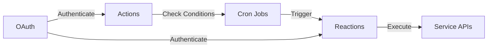

# Area

> An automation platform that connects different services through action-reaction workflows. Think IFTTT but self-hosted.

<div align="center">

**[Live Demo](https://area-prod.onrender.com)** • **[API Documentation](https://area-prod-back.onrender.com/docs)**

</div>

> [!NOTE]
> Automatically deployed to Render via GitHub Actions on every push to `main`

## What it does

Area lets you create automation rules (called "applets") by connecting triggers (actions) from one service to responses (reactions) in another. When an action's condition is met, its paired reactions execute automatically.

**Examples:**
- Post to Discord when you push to GitHub
- Send an email when the weather changes
- Add a Spotify song to a playlist when you favorite a track
- Create a Todoist task when a new GitHub issue is opened

## Supported Services

<div align="center">

### 20+ Integrated Services

</div>

| Category | Services |
|----------|----------|
| **Social** | Discord, Reddit, Twitch, LinkedIn |
| **Development** | GitHub, Figma, Notion |
| **Cloud Storage** | Dropbox |
| **Music & Media** | Spotify, YouTube, Podcast, Trakt |
| **Productivity** | Google Calendar, Gmail, Outlook, Todoist |
| **Fitness** | Strava, Clash Royale |
| **Weather** | OpenMeteo |
| **Utilities** | Email, Date/Time triggers, IGN |

## Architecture

The project is fully containerized with Docker Everything runs in Docker containers for development and production.

### Components

| Component | Technology | Description |
|-----------|------------|-------------|
| **Backend** | FastAPI | Service-based automation system with cron-triggered actions |
| **Frontend** | Next.js | Visual workflow builder for creating applets |
| **Mobile** | Flutter | Cross-platform mobile app (APK distributed via shared volume) |
| **Database** | PostgreSQL | Data persistence for users, services, and automations |

### How it works



1. **Actions** check conditions periodically (configured cron intervals)
2. **Reactions** execute when their paired action triggers
3. **Cron jobs** are dynamically created/deleted based on enabled areas
4. **OAuth flows** handle service authentication for both web and mobile

## Quick Start

> [!IMPORTANT]
> **Prerequisites:**
> - Docker & Docker Compose
> - Git

### Running the Application


1. **Configure environment variables**
   
   Copy the example files and fill in your OAuth credentials:
   ```bash
   cp server/.env.example server/.env
   cp frontend/.env.example frontend/.env
   cp frontend/.env.prod.example frontend/.env.prod
   ```

   > [!TIP]
   > See the [Configuration](#configuration) section for details on getting OAuth credentials.

2. **Start all services**
   ```bash
   docker compose up --build
   ```

   This will start:
   - **Frontend:** http://localhost:8081
   - **Backend API:** http://localhost:8080
   - **PostgreSQL:** localhost:5432
   - **Mobile APK builder:** Outputs to shared volume

3. **Access the application**
   - Web: Navigate to http://localhost:8081
   - Mobile: Download APK from `http://localhost:8081/client.apk` endpoint

## Configuration

> [!WARNING]
> The application requires OAuth credentials for each service you want to use. Copy the `.env.example` files and configure them with your credentials.

### Backend Configuration (`server/.env`)

See `server/.env.example` for all available options. Key sections:

#### Core Settings
```env
POSTGRES_USER=area_user
POSTGRES_PASSWORD=your_secure_password
POSTGRES_DB=area_db
JWT_SECRET=your_jwt_secret_key_here
FRONT_URL=http://localhost:8081
```

#### OAuth Credentials

You'll need to create OAuth apps for each service:

| Service | Developer Portal | Required Scopes |
|---------|-----------------|-----------------|
| **GitHub** | https://github.com/settings/developers | `repo`, `user:email` |
| **Google** | https://console.cloud.google.com/ | `calendar`, `gmail` |
| **Microsoft** | https://portal.azure.com/ | `mail.read`, `calendars.read` |
| **Discord** | https://discord.com/developers/applications | `bot` |
| **Spotify** | https://developer.spotify.com/dashboard | `user-read-playback-state` |
| **Reddit** | https://www.reddit.com/prefs/apps | `read`, `identity` |
| **Twitch** | https://dev.twitch.tv/console | `user:read:email` |
| **...** | ... | `email` |

> [!TIP]
> See `.env.example` for the complete list of configuration options

Add credentials to `server/.env`:
```env
GITHUB_CLIENT_ID=your_github_client_id
GITHUB_CLIENT_SECRET=your_github_client_secret
SPOTIFY_CLIENT_ID=your_spotify_client_id
SPOTIFY_CLIENT_SECRET=your_spotify_client_secret
# ... etc for each service
```

### Frontend Configuration (`frontend/.env`)

```env
BACKEND_URL=http://backend:8080
```


### Frontend Configuration (`frontend/.env.prod`)

```env
BACKEND_URL=http://server:8080
```

For production deployment, change to your backend URL.

## Development

### Docker-First Approach

> [!TIP]
> Everything runs in Docker. Services are never run directly on the host machine (except for tests and linting).

### Development Workflow

<table>
<tr>
<td><strong>Development Environment</strong></td>
<td><strong>Production Environment</strong></td>
</tr>
<tr>
<td>

```bash
docker compose -f ./docker-compose.dev.yml up --build
```

</td>
<td>

```bash
docker compose up --build
```

</td>
</tr>
</table>

### Testing & Linting

> [!TIP]
> Tests and linting are run outside Docker in CI/CD pipelines.

<details>
<summary><strong>Backend Tests & Linting</strong></summary>

**PyTest:**
```bash
docker compose -f ./docker-compose.test.yml up --build
cd server
pip install -r requirements.txt
pytest -v --cov app/tests/
```

**Flake8:**
```bash
cd server
flake8 . --count --max-line-length=79
```

</details>

<details>
<summary><strong>Frontend Tests & Linting</strong></summary>

**Jest:**
```bash
cd frontend
npm install
npm run test
```

**ESLint:**
```bash
cd frontend
npm run lint
```

</details>

<details>
<summary><strong>Mobile Linting</strong></summary>

**Flutter:**
```bash
cd mobile
flutter analyse
```

</details>

### Docker Compose Files

| File | Purpose |
|------|---------|
| `docker-compose.yml` | Production configuration |
| `docker-compose.dev.yml` | Development with hot-reload |
| `docker-compose.test.yml` | Testing environment with isolated database |

## Deployment

> [!NOTE]
> The application is automatically deployed to Render when you push to the `main` branch.

| Service | URL |
|---------|-----|
| **Frontend** | https://area-prod.onrender.com |
| **Backend** | https://area-prod-back.onrender.com |

## API Documentation

Once running, access the auto-generated API docs:

| Documentation | URL |
|---------------|-----|
| **Swagger UI** | http://localhost:8080/docs |
| **ReDoc** | http://localhost:8080/redoc |

## Troubleshooting

<details>
<summary><strong>Database connection issues</strong></summary>

```bash
# Recreate database
docker compose down -v
docker compose up --build
```

</details>

<details>
<summary><strong>OAuth redirect issues</strong></summary>

> [!CAUTION]
> Ensure your OAuth app redirect URLs match:
> - **Web:** `http://localhost:8081/callbacks/{oauth_type}/{service}`
> - **Mobile:** Custom scheme configured in `FRONT_URL`

</details>

<details>
<summary><strong>Port conflicts</strong></summary>

If ports 8080/8081/5432 are in use, modify `docker-compose.yml`:
```yaml
ports:
  - "____(any free port):3000"  # Change left side only
```

</details>

## License

This is an Epitech school project (3rd year - 2025).

## Contributors

See Git history for contributor information.
